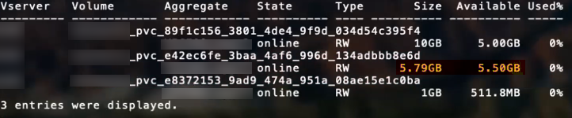

= ONTAP SAN-Konfigurationsoptionen und Beispiele
:hardbreaks:
:allow-uri-read: 
:icons: font
:imagesdir: ../media/

[role="lead"]
Erfahren Sie, wie Sie ONTAP SAN-Treiber mit Ihrer Trident -Installation erstellen und verwenden.  Dieser Abschnitt enthält Beispiele für die Backend-Konfiguration und Details zur Zuordnung von Backends zu StorageClasses.

link:https://docs.netapp.com/us-en/asa-r2/get-started/learn-about.html["ASA r2-Systeme"^]Sie unterscheiden sich von anderen ONTAP Systemen (ASA, AFF und FAS) in der Implementierung ihrer Speicherschicht.  Diese Abweichungen wirken sich wie angegeben auf die Verwendung bestimmter Parameter aus. link:https://docs.netapp.com/us-en/asa-r2/learn-more/hardware-comparison.html["Erfahren Sie mehr über die Unterschiede zwischen ASA r2-Systemen und anderen ONTAP Systemen."^].

NOTE: Nur die `ontap-san` Der Treiber (mit iSCSI- und NVMe/TCP-Protokollen) wird für ASA r2-Systeme unterstützt.

In der Trident Backend-Konfiguration müssen Sie nicht angeben, dass Ihr System ASA r2 ist.  Wenn Sie auswählen `ontap-san` als die `storageDriverName` Trident erkennt automatisch das ASA r2- oder das herkömmliche ONTAP System.  Einige Backend-Konfigurationsparameter sind für ASA r2-Systeme nicht anwendbar, wie in der folgenden Tabelle vermerkt.

== Backend-Konfigurationsoptionen

Die folgenden Tabellen enthalten die Backend-Konfigurationsoptionen:

[cols="1,3,2"]
|===
| Parameter | Beschreibung | Standard 

| `version` |  | Immer 1 

| `storageDriverName` | Name des Speichertreibers | `ontap-san`oder `ontap-san-economy` 

| `backendName` | Benutzerdefinierter Name oder das Speicher-Backend | Fahrername + "_" + dataLIF 

| `managementLIF`  a| 
IP-Adresse eines Cluster- oder SVM-Management-LIF.

Es kann ein vollqualifizierter Domänenname (FQDN) angegeben werden.

Kann so eingestellt werden, dass IPv6-Adressen verwendet werden, wenn Trident mit dem IPv6-Flag installiert wurde.  IPv6-Adressen müssen in eckigen Klammern definiert werden, z. B. `[28e8:d9fb:a825:b7bf:69a8:d02f:9e7b:3555]` .

Für einen nahtlosen MetroCluster Wechsel siehe<<mcc-best>> .

NOTE: Wenn Sie die Anmeldeinformationen „vsadmin“ verwenden, `managementLIF` muss die des SVM sein; bei Verwendung von "Admin"-Anmeldeinformationen, `managementLIF` muss die des Clusters sein.
| „10.0.0.1“, „[2001:1234:abcd::fefe]“ 

| `dataLIF` | IP-Adresse des Protokolls LIF.  Kann so eingestellt werden, dass IPv6-Adressen verwendet werden, wenn Trident mit dem IPv6-Flag installiert wurde.  IPv6-Adressen müssen in eckigen Klammern definiert werden, z. B. `[28e8:d9fb:a825:b7bf:69a8:d02f:9e7b:3555]` .  *Nicht für iSCSI angeben.*  Trident Anwendungenlink:https://docs.netapp.com/us-en/ontap/san-admin/selective-lun-map-concept.html["ONTAP Selective LUN Map"^] um die iSCSI LIFs zu ermitteln, die zum Aufbau einer Multipath-Sitzung benötigt werden.  Es wird eine Warnung generiert, wenn `dataLIF` ist explizit definiert.  *Für Metrocluster auslassen.* Siehe die<<mcc-best>> . | Abgeleitet durch die SVM 

| `svm` | Zu verwendende virtuelle Speichermaschine *Für Metrocluster auslassen.* Siehe die<<mcc-best>> . | Abgeleitet, wenn eine SVM `managementLIF` wird angegeben 

| `useCHAP` | Verwenden Sie CHAP zur Authentifizierung von iSCSI für ONTAP SAN-Treiber [Boolesch].  Auf einstellen `true` damit Trident bidirektionales CHAP als Standardauthentifizierung für die im Backend angegebene SVM konfiguriert und verwendet. Siehe link:ontap-san-prep.html["Bereiten Sie die Konfiguration des Backends mit ONTAP SAN-Treibern vor."] für Details.  *Nicht unterstützt für FCP oder NVMe/TCP.* | `false` 

| `chapInitiatorSecret` | Geheimnis des CHAP-Initiators.  Erforderlich, wenn `useCHAP=true` | "" 

| `labels` | Satz beliebiger JSON-formatierter Bezeichnungen, die auf Datenträger angewendet werden sollen | "" 

| `chapTargetInitiatorSecret` | Geheimnis des CHAP-Zielinitiators.  Erforderlich, wenn `useCHAP=true` | "" 

| `chapUsername` | Eingehender Benutzername.  Erforderlich, wenn `useCHAP=true` | "" 

| `chapTargetUsername` | Zielbenutzername.  Erforderlich, wenn `useCHAP=true` | "" 

| `clientCertificate` | Base64-kodierter Wert des Clientzertifikats.  Wird für zertifikatsbasierte Authentifizierung verwendet | "" 

| `clientPrivateKey` | Base64-kodierter Wert des privaten Client-Schlüssels.  Wird für zertifikatsbasierte Authentifizierung verwendet | "" 

| `trustedCACertificate` | Base64-kodierter Wert des vertrauenswürdigen CA-Zertifikats. Optional.  Wird für die zertifikatsbasierte Authentifizierung verwendet. | "" 

| `username` | Für die Kommunikation mit dem ONTAP -Cluster ist ein Benutzername erforderlich. Wird für die auf Anmeldeinformationen basierende Authentifizierung verwendet. Informationen zur Active Directory-Authentifizierung finden Sie unter link:../trident-use/ontap-san-examples.html#authenticate-trident-to-a-backend-svm-using-active-directory-credentials["Authentifizieren Sie Trident bei einem Backend-SVM mithilfe von Active Directory-Anmeldeinformationen"]. | "" 

| `password` | Für die Kommunikation mit dem ONTAP -Cluster ist ein Passwort erforderlich. Wird für die auf Anmeldeinformationen basierende Authentifizierung verwendet. Informationen zur Active Directory-Authentifizierung finden Sie unter link:../trident-use/ontap-san-examples.html#authenticate-trident-to-a-backend-svm-using-active-directory-credentials["Authentifizieren Sie Trident bei einem Backend-SVM mithilfe von Active Directory-Anmeldeinformationen"]. | "" 

| `svm` | Zu verwendende virtuelle Speichermaschine | Abgeleitet, wenn eine SVM `managementLIF` wird angegeben 

| `storagePrefix` | Präfix, das beim Bereitstellen neuer Volumes in der SVM verwendet wird.  Kann später nicht geändert werden.  Um diesen Parameter zu aktualisieren, müssen Sie ein neues Backend erstellen. | `trident` 

| `aggregate`  a| 
Aggregat für die Bereitstellung (optional; falls festgelegt, muss es der SVM zugewiesen werden).  Für die `ontap-nas-flexgroup` Treiber, diese Option wird ignoriert.  Falls kein Aggregat zugewiesen ist, kann jedes der verfügbaren Aggregate zur Bereitstellung eines FlexGroup Volumes verwendet werden.

NOTE: Wenn das Aggregat in SVM aktualisiert wird, wird es in Trident automatisch durch Abfrage von SVM aktualisiert, ohne dass der Trident Controller neu gestartet werden muss.  Wenn Sie in Trident ein bestimmtes Aggregat zur Bereitstellung von Volumes konfiguriert haben und dieses Aggregat umbenannt oder aus der SVM verschoben wird, wechselt das Backend in Trident in den Fehlerzustand, während es das SVM-Aggregat abfragt.  Sie müssen entweder das Aggregat in ein auf der SVM vorhandenes ändern oder es vollständig entfernen, um das Backend wieder online zu bringen.

*Nicht für ASA r2-Systeme angeben*.
 a| 
""

| `limitAggregateUsage` | Die Bereitstellung schlägt fehl, wenn die Auslastung diesen Prozentsatz überschreitet.  Wenn Sie ein Amazon FSx for NetApp ONTAP -Backend verwenden, geben Sie dies nicht an. `limitAggregateUsage` .  Die bereitgestellten `fsxadmin` Und `vsadmin` enthalten nicht die erforderlichen Berechtigungen, um die aggregierte Nutzung abzurufen und sie mit Trident einzuschränken.  *Nicht für ASA r2-Systeme angeben*. | "" (wird nicht standardmäßig erzwungen) 

| `limitVolumeSize` | Die Bereitstellung schlägt fehl, wenn die angeforderte Volume-Größe diesen Wert überschreitet. Außerdem wird die maximale Größe der von ihm verwalteten Volumes für LUNs beschränkt. | "" (wird nicht standardmäßig erzwungen) 

| `lunsPerFlexvol` | Die maximale Anzahl an LUNs pro Flexvol muss im Bereich [50, 200] liegen. | `100` 

| `debugTraceFlags` | Debug-Flags zur Verwendung bei der Fehlersuche.  Beispiel: {"api":false, "method":true} Verwenden Sie dies nur, wenn Sie eine Fehlerbehebung durchführen und einen detaillierten Protokollauszug benötigen. | `null` 

| `useREST`  a| 
Boolescher Parameter zur Verwendung von ONTAP REST-APIs.

 `useREST`Wenn eingestellt auf `true` Trident verwendet ONTAP REST-APIs zur Kommunikation mit dem Backend; wenn eingestellt auf `false` Trident verwendet ONTAPI (ZAPI)-Aufrufe zur Kommunikation mit dem Backend. Diese Funktion erfordert ONTAP 9.11.1 und höher.  Darüber hinaus muss die verwendete ONTAP Anmelderolle Zugriff auf die `ontapi` Anwendung.  Dies wird durch die vordefinierte Bedingung erfüllt. `vsadmin` Und `cluster-admin` Rollen.  Ab der Trident Version 24.06 und ONTAP 9.15.1 oder höher, `useREST` ist eingestellt auf `true` Standardmäßig; ändern `useREST` Zu `false` ONTAPI (ZAPI)-Aufrufe verwenden.

`useREST`ist vollständig für NVMe/TCP qualifiziert.

NOTE: NVMe wird nur mit ONTAP REST APIs unterstützt und nicht mit ONTAPI (ZAPI).

*Falls angegeben, immer auf setzen `true` für ASA r2-Systeme*.
| `true`für ONTAP 9.15.1 oder höher, andernfalls `false` . 

 a| 
`sanType`
| Zur Auswahl verwenden `iscsi` für iSCSI, `nvme` für NVMe/TCP oder `fcp` für SCSI über Fibre Channel (FC). | `iscsi`falls leer 

| `formatOptions`  a| 
Verwenden `formatOptions` um Befehlszeilenargumente für die `mkfs` Befehl, der immer dann angewendet wird, wenn ein Datenträger formatiert wird.  Dies ermöglicht es Ihnen, die Lautstärke nach Ihren Wünschen zu formatieren.  Stellen Sie sicher, dass Sie die Formatoptionen analog zu den Optionen des Befehls mkfs angeben, jedoch ohne den Gerätepfad.  Beispiel: "-E nodiscard"

*Unterstützt für `ontap-san` Und `ontap-san-economy` Treiber mit iSCSI-Protokoll.*  *Zusätzlich wird dies für ASA r2-Systeme bei Verwendung der iSCSI- und NVMe/TCP-Protokolle unterstützt.*
 a| 

| `limitVolumePoolSize` | Maximal anforderbare FlexVol Größe bei Verwendung von LUNs im ontap-san-economy-Backend. | "" (wird nicht standardmäßig erzwungen) 

| `denyNewVolumePools` | Beschränkt `ontap-san-economy` Backends daran zu hindern, neue FlexVol -Volumes zu erstellen, die ihre LUNs enthalten.  Für die Bereitstellung neuer PVs werden ausschließlich bereits vorhandene Flexvols verwendet. |  
|===

=== Empfehlungen zur Verwendung von formatOptions

Trident empfiehlt die folgende Option, um den Formatierungsprozess zu beschleunigen:

*-E nodiscard:*

* Blöcke sollten beim Erstellen des Dateisystems (mkfs) nicht verworfen werden (das anfängliche Verwerfen von Blöcken ist bei Solid-State-Geräten und dünn bereitgestellten Speichern sinnvoll).  Dies ersetzt die veraltete Option "-K" und ist auf alle Dateisysteme (xfs, ext3 und ext4) anwendbar.

=== Authentifizieren Sie Trident bei einem Backend-SVM mithilfe von Active Directory-Anmeldeinformationen

Sie können Trident so konfigurieren, dass es sich mit Active Directory (AD)-Anmeldeinformationen bei einem Back-End-SVM authentifiziert. Bevor ein AD-Konto auf die SVM zugreifen kann, müssen Sie den AD-Domänencontrollerzugriff auf den Cluster oder die SVM konfigurieren. Für die Clusterverwaltung mit einem AD-Konto müssen Sie einen Domänentunnel erstellen. Siehe link:https://docs.netapp.com/us-en/ontap/authentication/enable-ad-users-groups-access-cluster-svm-task.html["Konfigurieren des Active Directory-Domänencontrollerzugriffs in ONTAP"^] für Details.

.Schritte
. Konfigurieren Sie die DNS-Einstellungen (Domain Name System) für eine Back-End-SVM:
+
`vserver services dns create -vserver <svm_name> -dns-servers <dns_server_ip1>,<dns_server_ip2>`

. Führen Sie den folgenden Befehl aus, um ein Computerkonto für die SVM in Active Directory zu erstellen:
+
`vserver active-directory create -vserver DataSVM -account-name ADSERVER1 -domain demo.netapp.com`

. Verwenden Sie diesen Befehl, um einen AD-Benutzer oder eine AD-Gruppe zum Verwalten des Clusters oder SVM zu erstellen
+
`security login create -vserver <svm_name> -user-or-group-name <ad_user_or_group> -application <application> -authentication-method domain -role vsadmin`

. Legen Sie in der Trident Backend-Konfigurationsdatei Folgendes fest: `username` Und `password` Parameter auf den AD-Benutzer- oder Gruppennamen bzw. das Kennwort.

== Backend-Konfigurationsoptionen für die Bereitstellung von Volumes

Sie können die Standardbereitstellung mithilfe dieser Optionen steuern. `defaults` Abschnitt der Konfiguration.  Ein Beispiel finden Sie in den folgenden Konfigurationsbeispielen.

[cols="1,3,2"]
|===
| Parameter | Beschreibung | Standard 

| `spaceAllocation` | Speicherplatzzuweisung für LUNs | "true" *Falls angegeben, auf setzen `true` für ASA r2-Systeme*. 

| `spaceReserve` | Platzreservierungsmodus; "keine" (dünn) oder "Volumen" (dick).  *Einstellen auf `none` für ASA r2*-Systeme. | "keiner" 

| `snapshotPolicy` | Zu verwendende Snapshot-Richtlinie.  *Einstellen auf `none` für ASA r2-Systeme*. | "keiner" 

| `qosPolicy` | Die QoS-Richtliniengruppe soll den erstellten Volumes zugewiesen werden.  Wählen Sie pro Speicherpool/Backend entweder qosPolicy oder adaptiveQosPolicy.  Die Verwendung von QoS-Richtliniengruppen mit Trident erfordert ONTAP 9.8 oder höher.  Sie sollten eine nicht gemeinsam genutzte QoS-Richtliniengruppe verwenden und sicherstellen, dass die Richtliniengruppe auf jeden einzelnen Bestandteil angewendet wird.  Eine gemeinsam genutzte QoS-Richtliniengruppe setzt die Obergrenze für den Gesamtdurchsatz aller Workloads durch. | "" 

| `adaptiveQosPolicy` | Adaptive QoS-Richtliniengruppe, die den erstellten Volumes zugewiesen werden soll.  Wählen Sie pro Speicherpool/Backend entweder qosPolicy oder adaptiveQosPolicy aus. | "" 

| `snapshotReserve` | Prozentsatz des für Snapshots reservierten Speichervolumens.  *Nicht für ASA r2-Systeme angeben*. | "0" wenn `snapshotPolicy` ist "keine", ansonsten "" 

| `splitOnClone` | Beim Erstellen eines Klons diesen von seinem Elternklon trennen | "FALSCH" 

| `encryption` | Aktivieren Sie die NetApp Volumeverschlüsselung (NVE) auf dem neuen Volume; Standardwert ist `false` .  Um diese Option nutzen zu können, muss NVE auf dem Cluster lizenziert und aktiviert sein.  Wenn NAE im Backend aktiviert ist, wird jedes in Trident bereitgestellte Volume NAE-fähig sein.  Weitere Informationen finden Sie unter:link:../trident-reco/security-reco.html["Wie Trident mit NVE und NAE zusammenarbeitet"] . | "false" *Falls angegeben, auf setzen. `true` für ASA r2-Systeme*. 

| `luksEncryption` | LUKS-Verschlüsselung aktivieren. Siehelink:../trident-reco/security-luks.html["Verwenden Sie Linux Unified Key Setup (LUKS)."] . | *Einstellen auf `false` für ASA r2-Systeme*. 

| `tieringPolicy` | Tiering-Richtlinie auf "keine" setzen *Für ASA r2-Systeme nicht angeben* . |  

| `nameTemplate` | Vorlage zum Erstellen benutzerdefinierter Datenträgernamen. | "" 
|===

=== Beispiele für die Volumenbereitstellung

Hier ist ein Beispiel mit vordefinierten Standardwerten:

[source, yaml]
----
---
version: 1
storageDriverName: ontap-san
managementLIF: 10.0.0.1
svm: trident_svm
username: admin
password: <password>
labels:
  k8scluster: dev2
  backend: dev2-sanbackend
storagePrefix: alternate-trident
debugTraceFlags:
  api: false
  method: true
defaults:
  spaceReserve: volume
  qosPolicy: standard
  spaceAllocation: 'false'
  snapshotPolicy: default
  snapshotReserve: '10'

----

NOTE: Für alle mit der `ontap-san` Der Trident -Treiber erweitert die FlexVol -Kapazität um zusätzliche 10 Prozent, um die LUN-Metadaten aufzunehmen.  Die LUN wird mit der exakten Größe bereitgestellt, die der Benutzer im PVC anfordert.  Trident erhöht den FlexVol um 10 Prozent (wird in ONTAP als verfügbare Größe angezeigt).  Die Nutzer erhalten nun die von ihnen angeforderte nutzbare Speicherkapazität.  Diese Änderung verhindert auch, dass LUNs schreibgeschützt werden, es sei denn, der verfügbare Speicherplatz wird vollständig genutzt.  Dies gilt nicht für ontap-san-economy.

Für Backends, die definieren `snapshotReserve` Trident berechnet die Größe von Volumina wie folgt:

[listing]
----
Total volume size = [(PVC requested size) / (1 - (snapshotReserve percentage) / 100)] * 1.1
----
Die 1.1 sind die zusätzlichen 10 Prozent, die Trident zum FlexVol hinzufügt, um die LUN-Metadaten unterzubringen. Für `snapshotReserve` = 5% und PVC-Anforderung = 5 GiB, die Gesamtvolumengröße beträgt 5,79 GiB und die verfügbare Größe beträgt 5,5 GiB.  Der `volume show` Der Befehl sollte ähnliche Ergebnisse wie in diesem Beispiel liefern:

Aktuell ist die Größenänderung die einzige Möglichkeit, die neue Berechnung für ein bestehendes Volumen zu nutzen.

== Beispiele für minimale Konfigurationen

Die folgenden Beispiele zeigen Basiskonfigurationen, bei denen die meisten Parameter auf Standardwerte eingestellt bleiben.  Dies ist die einfachste Möglichkeit, ein Backend zu definieren.

NOTE: Wenn Sie Amazon FSx auf NetApp ONTAP mit Trident verwenden, empfiehlt NetApp, für LIFs DNS-Namen anstelle von IP-Adressen anzugeben.

.ONTAP SAN-Beispiel
[%collapsible]
====
Dies ist eine Basiskonfiguration unter Verwendung der `ontap-san` Treiber.

[source, yaml]
----
---
version: 1
storageDriverName: ontap-san
managementLIF: 10.0.0.1
svm: svm_iscsi
labels:
  k8scluster: test-cluster-1
  backend: testcluster1-sanbackend
username: vsadmin
password: <password>
----
====
.MetroCluster Beispiel
[#mcc-best%collapsible]
====
Sie können das Backend so konfigurieren, dass eine manuelle Aktualisierung der Backend-Definition nach einem Switchover und Switchback vermieden wird.link:../trident-reco/backup.html#svm-replication-and-recovery["SVM-Replikation und -Wiederherstellung"] .

Für einen nahtlosen Übergang und Rückwechsel geben Sie die SVM wie folgt an: `managementLIF` und lassen Sie die `svm` Parameter. Beispiel:

[source, yaml]
----
version: 1
storageDriverName: ontap-san
managementLIF: 192.168.1.66
username: vsadmin
password: password
----
====
.ONTAP SAN Wirtschaftsbeispiel
[%collapsible]
====
[source, yaml]
----
version: 1
storageDriverName: ontap-san-economy
managementLIF: 10.0.0.1
svm: svm_iscsi_eco
username: vsadmin
password: <password>
----
====
.Beispiel für zertifikatsbasierte Authentifizierung
[%collapsible]
====
In diesem Beispiel für eine einfache Konfiguration `clientCertificate` , `clientPrivateKey` , Und `trustedCACertificate` (optional, falls eine vertrauenswürdige Zertifizierungsstelle verwendet wird) werden in `backend.json` und nehmen Sie die Base64-kodierten Werte des Clientzertifikats, des privaten Schlüssels bzw. des vertrauenswürdigen CA-Zertifikats.

[source, yaml]
----
---
version: 1
storageDriverName: ontap-san
backendName: DefaultSANBackend
managementLIF: 10.0.0.1
svm: svm_iscsi
useCHAP: true
chapInitiatorSecret: cl9qxIm36DKyawxy
chapTargetInitiatorSecret: rqxigXgkesIpwxyz
chapTargetUsername: iJF4heBRT0TCwxyz
chapUsername: uh2aNCLSd6cNwxyz
clientCertificate: ZXR0ZXJwYXB...ICMgJ3BhcGVyc2
clientPrivateKey: vciwKIyAgZG...0cnksIGRlc2NyaX
trustedCACertificate: zcyBbaG...b3Igb3duIGNsYXNz
----
====
.Beispiele für bidirektionale CHAP-Programme
[%collapsible]
====
Diese Beispiele erstellen ein Backend mit `useCHAP` eingestellt auf `true` .

.ONTAP SAN CHAP Beispiel
[source, yaml]
----
---
version: 1
storageDriverName: ontap-san
managementLIF: 10.0.0.1
svm: svm_iscsi
labels:
  k8scluster: test-cluster-1
  backend: testcluster1-sanbackend
useCHAP: true
chapInitiatorSecret: cl9qxIm36DKyawxy
chapTargetInitiatorSecret: rqxigXgkesIpwxyz
chapTargetUsername: iJF4heBRT0TCwxyz
chapUsername: uh2aNCLSd6cNwxyz
username: vsadmin
password: <password>
----
.ONTAP SAN Wirtschaft CHAP Beispiel
[source, yaml]
----
---
version: 1
storageDriverName: ontap-san-economy
managementLIF: 10.0.0.1
svm: svm_iscsi_eco
useCHAP: true
chapInitiatorSecret: cl9qxIm36DKyawxy
chapTargetInitiatorSecret: rqxigXgkesIpwxyz
chapTargetUsername: iJF4heBRT0TCwxyz
chapUsername: uh2aNCLSd6cNwxyz
username: vsadmin
password: <password>
----
====
.NVMe/TCP-Beispiel
[%collapsible]
====
Sie benötigen eine SVM, die mit NVMe auf Ihrem ONTAP Backend konfiguriert ist.  Dies ist eine grundlegende Backend-Konfiguration für NVMe/TCP.

[source, yaml]
----
---
version: 1
backendName: NVMeBackend
storageDriverName: ontap-san
managementLIF: 10.0.0.1
svm: svm_nvme
username: vsadmin
password: password
sanType: nvme
useREST: true
----
====
.SCSI über FC (FCP) Beispiel
[%collapsible]
====
Sie benötigen eine SVM, die mit FC auf Ihrem ONTAP Backend konfiguriert ist.  Dies ist eine grundlegende Backend-Konfiguration für FC.

[source, yaml]
----
---
version: 1
backendName: fcp-backend
storageDriverName: ontap-san
managementLIF: 10.0.0.1
svm: svm_fc
username: vsadmin
password: password
sanType: fcp
useREST: true
----
====
.Backend-Konfigurationsbeispiel mit nameTemplate
[%collapsible]
====
[source, yaml]
----
---
version: 1
storageDriverName: ontap-san
backendName: ontap-san-backend
managementLIF: <ip address>
svm: svm0
username: <admin>
password: <password>
defaults:
  nameTemplate: "{{.volume.Name}}_{{.labels.cluster}}_{{.volume.Namespace}}_{{.vo\
    lume.RequestName}}"
labels:
  cluster: ClusterA
  PVC: "{{.volume.Namespace}}_{{.volume.RequestName}}"
----
====
.Beispiel für formatOptions für den ontap-san-economy-Treiber
[%collapsible]
====
[source, yaml]
----
---
version: 1
storageDriverName: ontap-san-economy
managementLIF: ""
svm: svm1
username: ""
password: "!"
storagePrefix: whelk_
debugTraceFlags:
  method: true
  api: true
defaults:
  formatOptions: -E nodiscard
----
====

== Beispiele für Backends mit virtuellen Pools

In diesen Beispiel-Backend-Definitionsdateien sind spezifische Standardwerte für alle Speicherpools festgelegt, wie zum Beispiel `spaceReserve` bei keiner, `spaceAllocation` bei falsch und `encryption` bei falsch.  Die virtuellen Pools werden im Speicherbereich definiert.

Trident legt Bereitstellungsbezeichnungen im Feld „Kommentare“ fest.  Kommentare werden auf dem FlexVol volume festgelegt. Trident kopiert bei der Bereitstellung alle auf einem virtuellen Pool vorhandenen Labels auf das Speichervolume.  Zur Vereinfachung können Speicheradministratoren Bezeichnungen pro virtuellem Pool definieren und Volumes nach Bezeichnung gruppieren.

In diesen Beispielen legen einige der Speicherpools ihre eigenen Einstellungen fest. `spaceReserve` , `spaceAllocation` , Und `encryption` Werte, und einige Pools überschreiben die Standardwerte.

.ONTAP SAN-Beispiel
[%collapsible]
====
[source, yaml]
----
---
version: 1
storageDriverName: ontap-san
managementLIF: 10.0.0.1
svm: svm_iscsi
useCHAP: true
chapInitiatorSecret: cl9qxIm36DKyawxy
chapTargetInitiatorSecret: rqxigXgkesIpwxyz
chapTargetUsername: iJF4heBRT0TCwxyz
chapUsername: uh2aNCLSd6cNwxyz
username: vsadmin
password: <password>
defaults:
  spaceAllocation: "false"
  encryption: "false"
  qosPolicy: standard
labels:
  store: san_store
  kubernetes-cluster: prod-cluster-1
region: us_east_1
storage:
  - labels:
      protection: gold
      creditpoints: "40000"
    zone: us_east_1a
    defaults:
      spaceAllocation: "true"
      encryption: "true"
      adaptiveQosPolicy: adaptive-extreme
  - labels:
      protection: silver
      creditpoints: "20000"
    zone: us_east_1b
    defaults:
      spaceAllocation: "false"
      encryption: "true"
      qosPolicy: premium
  - labels:
      protection: bronze
      creditpoints: "5000"
    zone: us_east_1c
    defaults:
      spaceAllocation: "true"
      encryption: "false"

----
====
.ONTAP SAN Wirtschaftsbeispiel
[%collapsible]
====
[source, yaml]
----
---
version: 1
storageDriverName: ontap-san-economy
managementLIF: 10.0.0.1
svm: svm_iscsi_eco
useCHAP: true
chapInitiatorSecret: cl9qxIm36DKyawxy
chapTargetInitiatorSecret: rqxigXgkesIpwxyz
chapTargetUsername: iJF4heBRT0TCwxyz
chapUsername: uh2aNCLSd6cNwxyz
username: vsadmin
password: <password>
defaults:
  spaceAllocation: "false"
  encryption: "false"
labels:
  store: san_economy_store
region: us_east_1
storage:
  - labels:
      app: oracledb
      cost: "30"
    zone: us_east_1a
    defaults:
      spaceAllocation: "true"
      encryption: "true"
  - labels:
      app: postgresdb
      cost: "20"
    zone: us_east_1b
    defaults:
      spaceAllocation: "false"
      encryption: "true"
  - labels:
      app: mysqldb
      cost: "10"
    zone: us_east_1c
    defaults:
      spaceAllocation: "true"
      encryption: "false"
  - labels:
      department: legal
      creditpoints: "5000"
    zone: us_east_1c
    defaults:
      spaceAllocation: "true"
      encryption: "false"

----
====
.NVMe/TCP-Beispiel
[%collapsible]
====
[source, yaml]
----
---
version: 1
storageDriverName: ontap-san
sanType: nvme
managementLIF: 10.0.0.1
svm: nvme_svm
username: vsadmin
password: <password>
useREST: true
defaults:
  spaceAllocation: "false"
  encryption: "true"
storage:
  - labels:
      app: testApp
      cost: "20"
    defaults:
      spaceAllocation: "false"
      encryption: "false"

----
====

== Backends StorageClasses zuordnen

Die folgenden StorageClass-Definitionen beziehen sich auf die<<Beispiele für Backends mit virtuellen Pools>> .  Verwenden des `parameters.selector` Im Feld „StorageClass“ wird für jede StorageClass angegeben, welche virtuellen Pools zum Hosten eines Volumes verwendet werden können.  Das Volumen wird die im gewählten virtuellen Pool definierten Aspekte aufweisen.

* Der `protection-gold` Die StorageClass wird dem ersten virtuellen Pool im `ontap-san` Backend.  Dies ist der einzige Pool, der Schutz auf Goldniveau bietet.
+
[source, yaml]
----
apiVersion: storage.k8s.io/v1
kind: StorageClass
metadata:
  name: protection-gold
provisioner: csi.trident.netapp.io
parameters:
  selector: "protection=gold"
  fsType: "ext4"
----
* Der `protection-not-gold` Die StorageClass wird dem zweiten und dritten virtuellen Pool zugeordnet. `ontap-san` Backend.  Dies sind die einzigen Pools, die ein anderes Schutzniveau als Gold bieten.
+
[source, yaml]
----
apiVersion: storage.k8s.io/v1
kind: StorageClass
metadata:
  name: protection-not-gold
provisioner: csi.trident.netapp.io
parameters:
  selector: "protection!=gold"
  fsType: "ext4"
----
* Der `app-mysqldb` Die StorageClass wird dem dritten virtuellen Pool zugeordnet. `ontap-san-economy` Backend.  Dies ist der einzige Pool, der eine Speicherpoolkonfiguration für Anwendungen vom Typ mysqldb bietet.
+
[source, yaml]
----
apiVersion: storage.k8s.io/v1
kind: StorageClass
metadata:
  name: app-mysqldb
provisioner: csi.trident.netapp.io
parameters:
  selector: "app=mysqldb"
  fsType: "ext4"
----
* Der `protection-silver-creditpoints-20k` Die StorageClass wird dem zweiten virtuellen Pool zugeordnet. `ontap-san` Backend.  Dies ist der einzige Pool, der Schutz auf Silber-Niveau und 20000 Kreditpunkte bietet.
+
[source, yaml]
----
apiVersion: storage.k8s.io/v1
kind: StorageClass
metadata:
  name: protection-silver-creditpoints-20k
provisioner: csi.trident.netapp.io
parameters:
  selector: "protection=silver; creditpoints=20000"
  fsType: "ext4"
----
* Der `creditpoints-5k` Die StorageClass wird dem dritten virtuellen Pool zugeordnet. `ontap-san` Backend und der vierte virtuelle Pool im `ontap-san-economy` Backend.  Dies sind die einzigen Poolangebote mit 5000 Kreditpunkten.
+
[source, yaml]
----
apiVersion: storage.k8s.io/v1
kind: StorageClass
metadata:
  name: creditpoints-5k
provisioner: csi.trident.netapp.io
parameters:
  selector: "creditpoints=5000"
  fsType: "ext4"
----
* Der `my-test-app-sc` Die StorageClass wird der folgenden zugeordnet: `testAPP` virtueller Pool im `ontap-san` Fahrer mit `sanType: nvme` .  Dies ist das einzige Poolangebot `testApp` .
+
[source, yaml]
----
---
apiVersion: storage.k8s.io/v1
kind: StorageClass
metadata:
  name: my-test-app-sc
provisioner: csi.trident.netapp.io
parameters:
  selector: "app=testApp"
  fsType: "ext4"
----

Trident entscheidet, welcher virtuelle Pool ausgewählt wird und stellt sicher, dass die Speicheranforderungen erfüllt werden.
